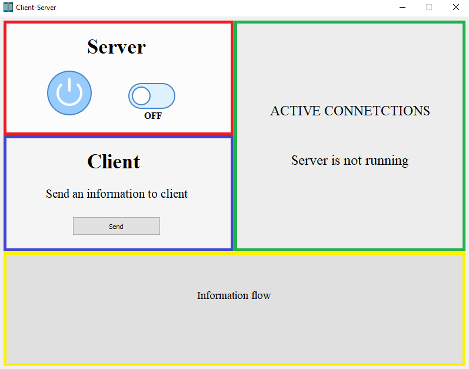
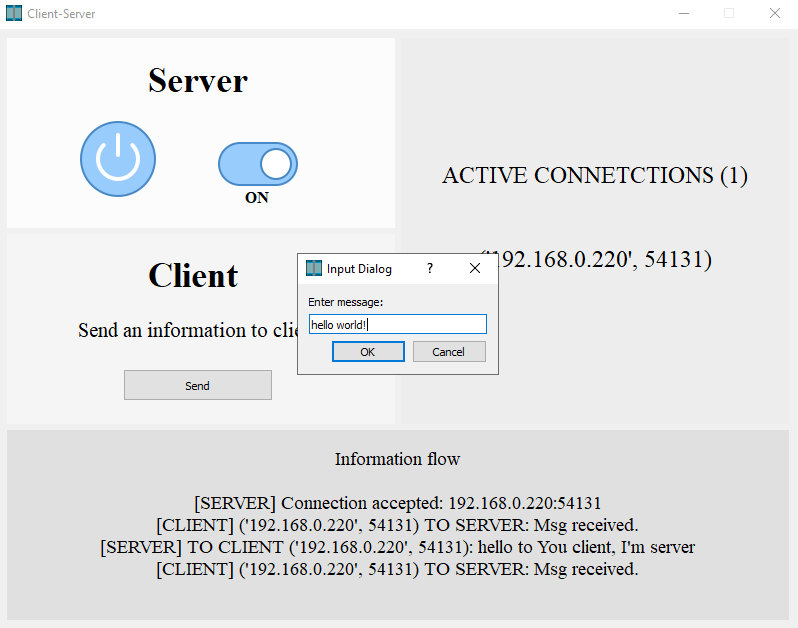

<!-- Heading -->
## Multi-Client-Server in Python
<!-- Links -->
#### Jeremiasz Macura

### Description
<!-- UL -->
Project Multi-Client-Server written in Python using sockets, multithreading and PyQt5.
Server is communicating with client thanks to sockets and each new client is maintained
in new thread. GUI was created using PyQt5. 
   

   
-  `Swtiching on and off area`
-  `Sending information to clients`
-  `Show a list of active connetctions`
-  `Show recived and send information`
   

